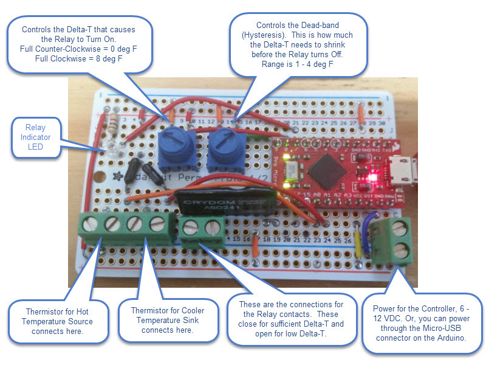
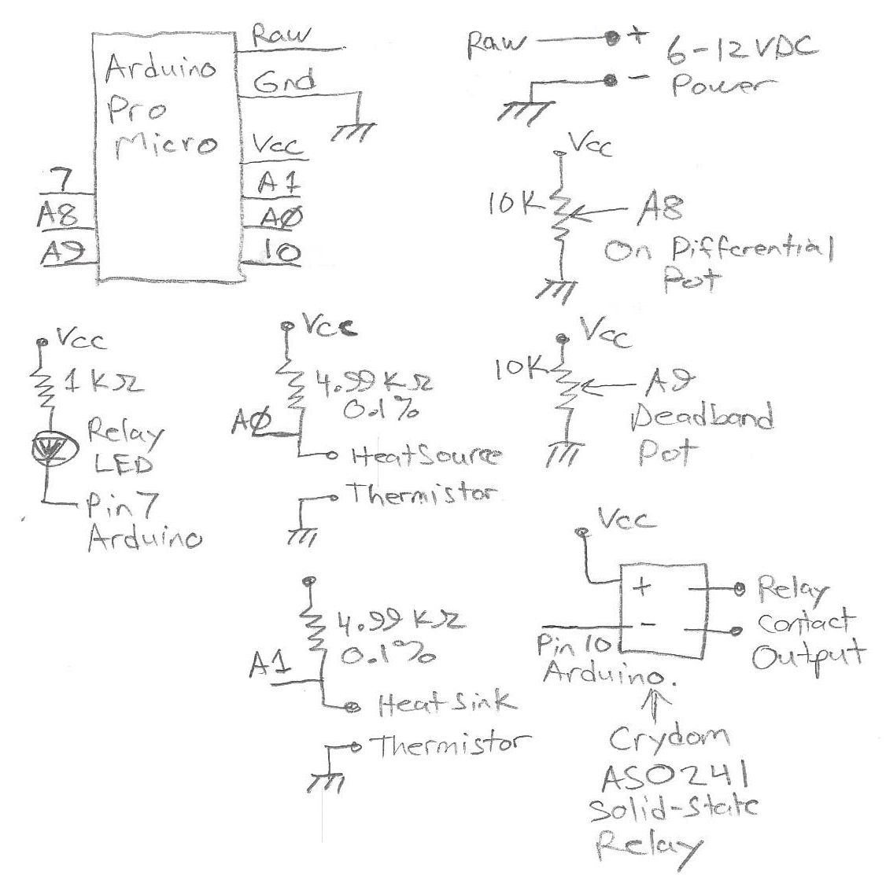
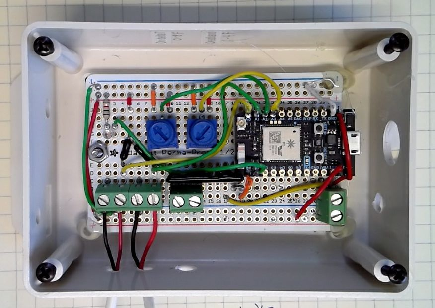

# Differential Temperature Controller

This is a simple Differential Temperature Controller that is implemented through use of an [Arduino Pro Micro](https://www.sparkfun.com/products/12640).  This controller was built to turn on a pump to transfer heat from one hydronic storage tank to another.  It could be used for other applications, such as Solar Hot Water Heater pump control.  A differential controller turns on a relay when the difference in temperature between a heat source and a heat sink is large enough.  The relay turns off once the temperature differential lessens by a certain amount known as the deadband.

Here is a picture of the Differential Temperature Controller built from this project:

There are two potentiometer (pot) controls on the board.  The left pot controls the level of differential temperature that causes the relay to turn On.  The code in this project currently sets the range of this pot to a differential temperature of 0 - 8 degrees Fahrenheit.  When the heat source temperature rises this many degrees above the heat sink temperature, the relay turns On.  

The right pot controls the "deadband" of the controller, and this pot has a range of 1 - 4 degrees Fahrenheit.  Once the controller turns the relay On due to sufficient temperature differential, the relay will not be turned Off until the temperature differential shrinks by this amount.  For example, if the On differential is set to 6 degrees F and the deadband is set to 2 degrees F, the controller will turn the relay On when the heat source rises **6 degrees F** above the temperature of the heat sink.  When that differential reduces to 6 deg F - 2 deg F = **4 deg F**, the relay will turn Off.

An LED is present and labeled on the diagram above to indicate the state of the controller's Relay.  The LED turns On when the relay is On.

Two thermistor temperature sensors connect to the controller to measure the temperature of the Heat Source and the Heat Sink.   A pair of screw terminals is provided to connect each of these temperature sensors, and these are shown in the diagram above.  The Arduino currently assumes that these sensors are [BAPI 10K-3 Thermistors](http://www.bapihvac.com/products/temperature-sensors/remote-probe-temperature-sensor/#configure).  Other thermistors can be used, but the Steinhart coefficients present in the Arduino code must be changed to match the actual thermistor used.

For the relay used in the project and specified below, the load connected to the relay must be an AC load from 12 to 280 VAC with a maximum current draw of 1.5 Amps.

The differential controller must be powered in one of two ways.  The Arduino Pro Micro has a micro-USB jack; one means of powering the controller is to connect a 5 VDC power supply to that jack.  As an alternative powering method, a 6 - 12 VDC power source can be connected to the screw terminals shown in the lower right corner of the diagram above.

---

A schematic of the differential controller circuit is shown below:

---

**Note:**  This circuit was redone using the [Partcile.io Photon board](https://docs.particle.io/datasheets/photon-datasheet/).  The revised code has not been posted to this repo yet.  Here is a picturage of the final unit:

